## 工厂模式
在调用者并不知道运行时真正的类名，可以创建出一个IPerson接口的类。使用枚举可以防止调用者拼写错误，更加方便的创建类。
注意，如果是简单的类创建没有必要引入工厂模式。

**优点：** 
>1、一个调用者想创建一个对象，只要知道其名称就可以了。 
> 
>2、扩展性高，如果想增加一个产品，只要扩展一个工厂类就可以。 
> 
>3、屏蔽产品的具体实现，调用者只关心产品的接口。

**缺点：**
>每次增加一个产品时，都需要增加一个具体类和对象实现工厂，使得系统中类的个数成倍增加，在一定程度上增加了系统的复杂度，同时也增加了系统具体类的依赖。这并不是什么好事。

**使用场景：** 
>1、日志记录器：
> 记录可能记录到本地硬盘、系统事件、远程服务器等，用户可以选择记录日志到什么地方。
> 
> 2、数据库访问:
> 当用户不知道最后系统采用哪一类数据库，以及数据库可能有变化时。 
> 
> 3、设计一个连接服务器的框架:
> 需要三个协议，"POP3"、"IMAP"、"HTTP"，可以把这三个作为产品类，共同实现一个接口。

